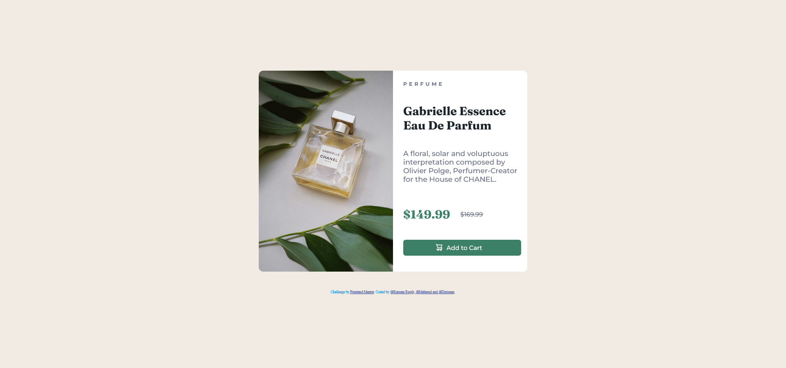

# Frontend Mentor - Product preview card component solution

This is a solution to the [Product preview card component challenge on Frontend Mentor](https://www.frontendmentor.io/challenges/product-preview-card-component-GO7UmttRfa).

## Table of contents

- [Overview](#overview)
  - [The challenge](#the-challenge)
  - [Screenshot](#screenshot)
  - [Links](#links)
- [My process](#my-process)
  - [Built with](#built-with)
  - [What I learned](#what-i-learned)
  - [Continued development](#continued-development)
  - [Useful resources](#useful-resources)
- [Author](#author)
- [Acknowledgments](#acknowledgments)

## Overview

### The challenge

Users should be able to:

- View the optimal layout depending on their device's screen size
- See hover and focus states for interactive elements

### Screenshot

### Links

- Solution URL: (https://github.com/Darionas/product-preview-card-component)
- Live Site URL: (https://darionas.github.io/product-preview-card-component/)
- FM site challenge URL: (https://www.frontendmentor.io/solutions/loopstudios-landing-page-GNk71HZSaO)

## My process

* Set HTML layout:
* Create CSS external file to set style for HTML layout:
  * To achieve responsive web design set grid layout module:
     * Create first for mobile;
     * Later for desktop layout;

### Built with

- Semantic HTML5 markup
- CSS

But created with love.

### What I learned

- It was repetition what I have learned.

### Continued development

- Grid layout module.
- JavaScript.
- Practice dealing with Git & GitHub.

### Useful resources

- none.

## Author

- Frontend Mentor - [@Darionas](https://www.frontendmentor.io/profile/Darionas)

## Acknowledgments

- Thank you Frontend Mentor team for opportunity to try, practice, train yourself in different level challenges and gain invaluable experience.
- Thank you @Vikram from Frontend Mentor for guidance.
